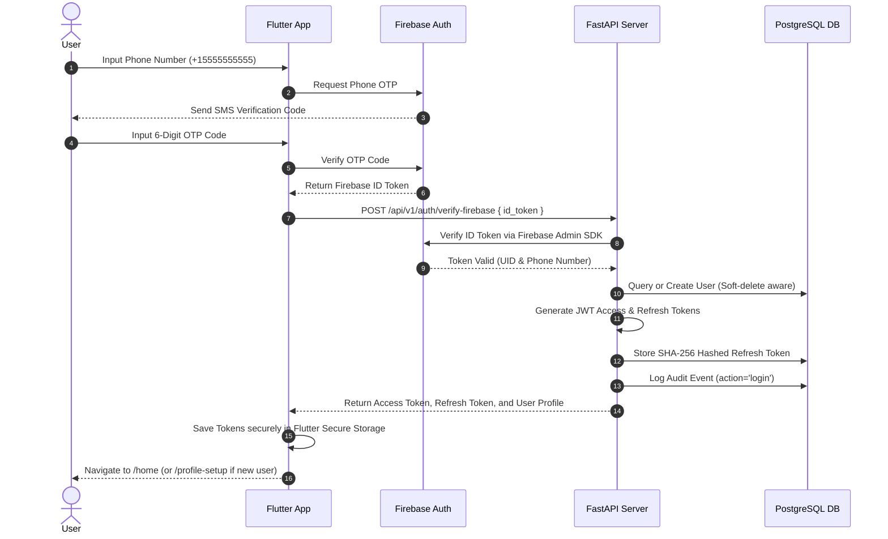

# Authentication Flow Documentation

This document explains the end-to-end authentication workflow for **ResQConnect**, covering Firebase Phone OTP verification, backend JWT creation, token refresh rotation, and session management.

---

## 🔄 Authentication Sequence Diagram

---

## 🔑 Key Authentication Phases

### 1. Phone OTP Verification
- The Flutter client initiates phone authentication via Firebase Authentication.
- Once verified, the client receives a short-lived **Firebase ID Token**.

### 2. Backend Verification & User Provisioning
- The client passes the Firebase ID token to `POST /api/v1/auth/verify-firebase`.
- The FastAPI backend validates the token using the `firebase-admin` SDK.
- If valid:
  - If the user exists in PostgreSQL, their `last_login` timestamp is updated.
  - If it is a new user, a user record is created with the default `citizen` role, and `is_new_user: true` is returned.

### 3. Session Token Issuance
- The backend generates:
  - **Access Token**: Short-lived (e.g., 30 minutes), containing `sub` (User ID) and `role`.
  - **Refresh Token**: Long-lived (e.g., 30 days), stored as a SHA-256 hash in `refresh_tokens`.
- Both tokens are sent in a standard response wrapper and saved in `FlutterSecureStorage`.

### 4. Automatic Token Refresh & Rotation
- When an API request returns `401 Unauthorized`, the client's `DioClient` interceptor catches the response.
- It posts the stored refresh token to `POST /api/v1/auth/refresh`.
- The backend verifies the token hash, revokes the old refresh token (rotation), issues a new pair of access and refresh tokens, and returns them.
- If refresh fails or token is revoked/expired, all tokens are cleared from secure storage and the user is redirected to `/welcome`.
